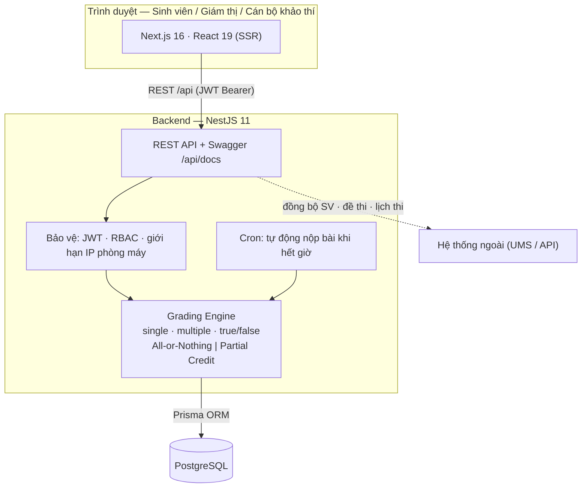

<div align="center">

# 🎓 DAU Examination System

### Hệ thống Tổ chức Thi Trắc nghiệm Trực tuyến — Đại học Kiến trúc Đà Nẵng

[](https://github.com/niitbeo/caira-khaothi-test/actions/workflows/ci.yml)
[](https://github.com/niitbeo/caira-khaothi-test/actions/workflows/build.yml)
[](LICENSE)
[](https://nodejs.org)

**Hệ thống full-stack tổ chức và vận hành các kỳ thi trắc nghiệm trên máy tính cho Trường Đại học Kiến trúc Đà Nẵng — hỗ trợ thi tập trung tại phòng máy và thi trực tuyến.**

[Bắt đầu](#-bắt-đầu) · [Tài liệu](#-tài-liệu) · [Quy trình Git](#-quy-trình-git) · [Giấy phép](#-giấy-phép)

</div>

---

## ✨ Tính năng chính

- **Tổ chức kỳ thi** — quản lý kỳ thi, ca thi, phòng thi, điểm danh.
- **Làm bài thi** — câu hỏi **một đáp án / nhiều đáp án / đúng-sai**, kèm **hình ảnh, video, âm thanh**; lưu đáp án tức thời, tự khôi phục khi mất kết nối.
- **Chấm điểm tự động (Grading Engine)** — chấm khi nộp bài; Multiple Choice hỗ trợ **tuyệt đối (All-or-Nothing)** hoặc **từng phần (Partial Credit)**.
- **Tự động nộp bài khi hết giờ** (cron mỗi phút).
- **Giám sát & vi phạm** — ghi nhận vi phạm, đính kèm bằng chứng.
- **Bảo mật** — JWT + RBAC, giới hạn dải IP phòng máy, ẩn đáp án khỏi API câu hỏi, sanitize nội dung (chống XSS).
- **Tài liệu API** — Swagger/OpenAPI tại `/api/docs`.

> Dữ liệu sinh viên, học phần, lịch thi, đề thi được đồng bộ từ các hệ thống khác qua API. Mục tiêu hỗ trợ **2.000 sinh viên thi đồng thời**.

## 🛠️ Công nghệ

| Lớp | Công nghệ |
|-----|-----------|
| **Frontend** | Next.js 16, React 19, TypeScript, Tailwind CSS |
| **Backend** | NestJS 11, TypeScript, Prisma ORM, PostgreSQL |
| **Xác thực** | JWT + Passport.js, phân quyền theo vai trò (RBAC) |
| **Tác vụ định kỳ** | `@nestjs/schedule` (tự động nộp bài hết giờ) |
| **CI/CD** | GitHub Actions, Docker, Docker Compose |
| **Kiểm thử** | Backend: Jest · Frontend: Vitest + Testing Library |

## 📐 Kiến trúc



| Tầng | Vai trò |
|------|---------|
| **Frontend (Next.js)** | SSR, giao diện làm bài, render câu hỏi (hình ảnh/video/audio), điều hướng câu hỏi |
| **Backend (NestJS)** | REST API, xác thực JWT + RBAC, chấm điểm, tự động nộp bài, đồng bộ dữ liệu ngoài |
| **PostgreSQL (Prisma)** | Lưu kỳ thi, ca thi, bài làm, đáp án, kết quả, vi phạm (23 model) |

## 📁 Cấu trúc dự án

```
caira--khaothi-test/
├── .github/                  # GitHub Actions & template
│   ├── workflows/            # ci.yml (lint+type+test+coverage), build, deploy
│   └── PULL_REQUEST_TEMPLATE.md   # Checklist 19 mục (Phụ lục B — CAIRA)
├── backend/                  # NestJS API
│   ├── prisma/schema.prisma  # Schema CSDL (23 model)
│   ├── src/                  # auth, exams, attempts (grading), violations, ...
│   └── test/                 # E2E (Supertest)
├── frontend/                 # Ứng dụng Next.js
│   └── src/components/exam/   # QuestionCard, Timer, ...
├── docs/                     # Tài liệu dự án
│   ├── 05-user-story.md · 08-api-contract.md · 07-erd.md ...
│   ├── 15-test-report-wave2-trac-nghiem.md   # Báo cáo QC (đạt sign-off)
│   ├── 11-qc-subagent-process.md          # Chuẩn vận hành sub-agent QC
│   ├── bugs/                              # Bug ticket theo chuẩn CAIRA
│   └── 13-rollback.md
├── mock-api/                 # Dữ liệu mock cho phát triển
├── CHANGELOG.md
└── README.md                 # ← Bạn đang ở đây
```

## 🚀 Bắt đầu

### Yêu cầu môi trường

- **Node.js** ≥ 20 · **npm** ≥ 10
- **PostgreSQL** ≥ 15 (hoặc dùng Docker)
- **Git**

### Khởi chạy nhanh

```bash
# 1. Clone repo
git clone https://github.com/niitbeo/caira-khaothi-test.git
cd caira-khaothi-test

# 2. Cài đặt phụ thuộc (backend + frontend)
npm run install:all

# 3. Thiết lập biến môi trường
cp backend/.env.example backend/.env       # chỉnh DATABASE_URL, JWT_SECRET...
# (hoặc dùng .env.docker khi chạy bằng Docker Compose)

# 4. Sinh Prisma Client + migrate CSDL
npm run prisma:generate
npm run prisma:migrate

# 5. NẠP DỮ LIỆU MẪU (6 đề + phòng + ca thi) — KHÔNG có sẵn trong repo
cd backend && npm run seed && cd ..

# 6. Chạy môi trường phát triển (cả BE + FE)
npm run dev
```

Frontend: `http://localhost:3000` · Backend API: `http://localhost:3001` · Swagger: `http://localhost:3001/api/docs`

> 🐳 **Dùng Docker (khuyến nghị):** `docker compose up` — tự `prisma generate` →
> `db push` → **seed dữ liệu mẫu** → chạy. Tức là **clone về + `docker compose up`
> là có sẵn 6 đề + phòng/ca** để dùng ngay. Cấu hình ở `docker-compose.yml`.

> 💡 **Lưu ý về dữ liệu:** GitHub chỉ chứa **code + script seed**, KHÔNG chứa dữ
> liệu DB. Dữ liệu mẫu do `prisma/seed.ts` tái tạo (chạy `npm run seed` hoặc tự
> động khi `docker compose up`). **Tài khoản** không cần seed — tạo tự động khi
> đăng nhập (`sv001`, `giamthi01`, `khaothi01`…). Câu hỏi đề lấy từ fixtures trong code.

### Các lệnh thường dùng

| Lệnh | Mô tả |
|------|-------|
| `npm run dev` | Chạy đồng thời backend + frontend (dev) |
| `npm run build` | Build cả hai dự án cho production |
| `npm run lint` | Lint cả hai dự án |
| `npm run test` | Chạy unit test cả hai dự án |
| `npm run prisma:studio` | Mở Prisma Studio (GUI cho CSDL) |
| `npm run prisma:migrate` | Chạy migration CSDL |

**Chạy test trực tiếp từng bên:**
```bash
cd backend  && npx jest && npm run test:cov   # 91 test + cổng coverage ≥80%
cd frontend && npx vitest --run               # 36 test
```

## 👥 Vai trò người dùng

| Vai trò | Mô tả |
|---------|-------|
| **Quản trị (Admin)** | Quản trị hệ thống, người dùng, vai trò, cấu hình |
| **Cán bộ khảo thí** | Quản lý kỳ thi, đề thi, ngân hàng câu hỏi, ma trận đề |
| **Giám thị (Invigilator)** | Coi thi, điểm danh, giám sát thời gian thực |
| **Sinh viên (Student)** | Làm bài thi, xem kết quả |

## 📖 Tài liệu

Tài liệu chi tiết nằm trong thư mục [`docs/`](./docs/):

- [Brief — Phân tích bài toán](./docs/00-brief.md) · [Tầm nhìn dự án](./docs/01-project-vision.md) · [SRS](./docs/02-srs.md) · [Use Cases](./docs/03-use-cases.md)
- [ERD](./docs/07-erd.md) · [API Contract](./docs/08-api-contract.md) · [User Stories](./docs/05-user-story.md)
- [Báo cáo QC (sign-off)](./docs/15-test-report-wave2-trac-nghiem.md) · [Bug tickets](./docs/bugs/) · [Chuẩn sub-agent QC](./docs/11-qc-subagent-process.md)
- [Acceptance Criteria](./docs/06-acceptance-criteria.md) · [Ma trận truy vết](./docs/16-traceability-matrix.md) · [CHANGELOG](./CHANGELOG.md) · [Kế hoạch Rollback](./docs/13-rollback.md)

> Dự án tuân theo **Quy trình phát triển phần mềm CAIRA-DAU v1.0** (tài liệu nội bộ): 9 bước, quality gates, QC sign-off, Swagger bắt buộc, coverage ≥ 80%.

## 🔀 Quy trình Git

Mô hình **4 nhánh** tương ứng 4 môi trường (xem Chương 6 — CAIRA-DAU v1.0):

```
main ──────●──────────●──── (production — chỉ Tech Lead, qua release PR)
            \        /
develop ─────●──●──●──────── (tích hợp / staging)
              \  |
feat/* ────────●─●────────── (phát triển từng tính năng → PR vào develop)
```

| Nhánh | Mục đích | Môi trường |
|-------|----------|------------|
| `main` | Bản phát hành production (được bảo vệ) | Production (thủ công) |
| `develop` | Tích hợp & nghiệm thu | Staging (tự động) |
| `feat/*`, `fix/*` | Phát triển tính năng | — |
| `hotfix/*` | Sửa khẩn cấp (từ `main`) | Production (fast-track) |

**Commit theo [Conventional Commits](https://www.conventionalcommits.org/):**
```
feat(grading): chấm điểm từng phần cho câu nhiều đáp án (US-077)
fix(exams): chuyển sang xóa mềm đề thi
docs(qc): bổ sung báo cáo test wave 2
chore(ci): thêm cổng coverage vào pipeline
```

## 🤝 Đóng góp

1. Tạo nhánh tính năng: `git checkout -b feat/PROJ-xxx-mo-ta-ngan` (từ `develop`)
2. Commit theo Conventional Commits
3. Push và mở **Pull Request vào `develop`**
4. Hoàn thành [checklist PR (19 mục)](.github/PULL_REQUEST_TEMPLATE.md) trước khi yêu cầu review

## 📄 Giấy phép

Phát hành theo **Giấy phép MIT** — xem [LICENSE](LICENSE).

---

<div align="center">

**Xây dựng tại Đại học Kiến trúc Đà Nẵng — CAIRA-DAU**

[⬆ Về đầu trang](#-dau-examination-system)

</div>
