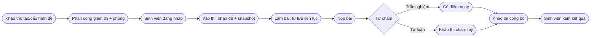
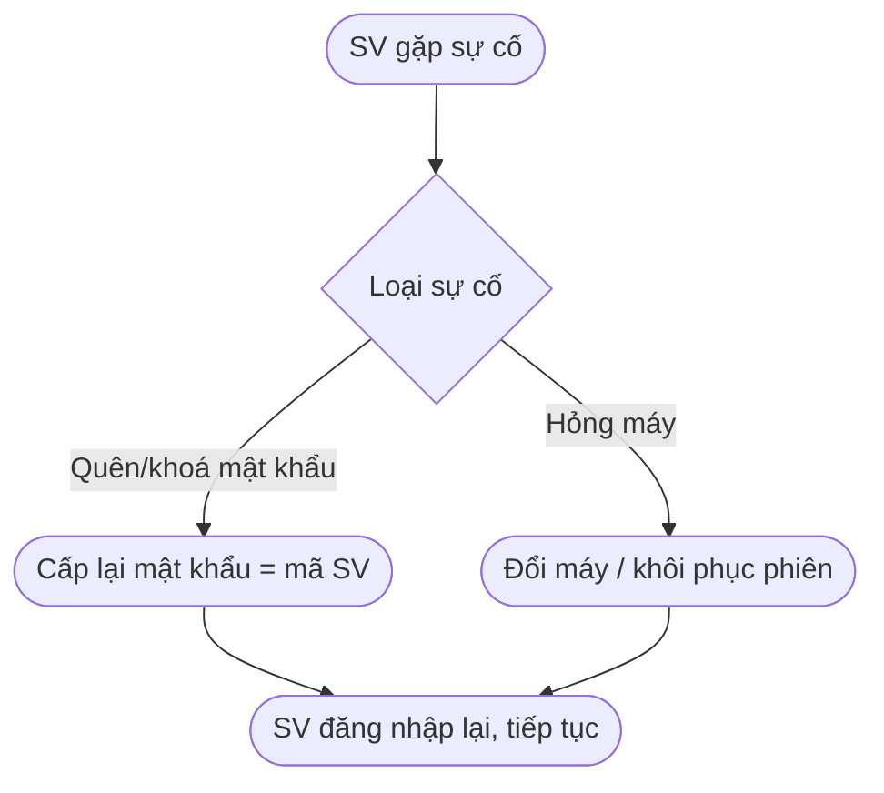
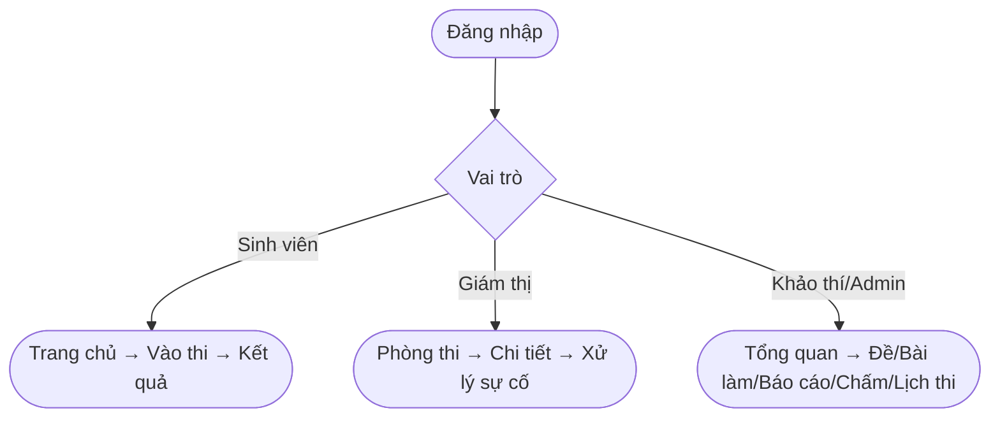

# Hướng dẫn sử dụng — Hệ thống Thi trắc nghiệm DAU

> **Đối tượng:** Sinh viên · Giám thị (cán bộ coi thi) · Khảo thí/Quản trị.
> **Phiên bản:** v1.0 · Trường Đại học Kiến trúc Đà Nẵng.
>
> 📷 **Ghi chú về ảnh:** Các sơ đồ trong tài liệu render trực tiếp trên GitHub
> (Mermaid). Ảnh chụp màn hình đặt trong thư mục [`docs/images/huong-dan/`](images/huong-dan/)
> — mỗi mục có sẵn chỗ chèn ``, chỉ cần bỏ file ảnh đúng tên vào.

---

## 1. Tổng quan

Hệ thống cho phép tổ chức **thi trắc nghiệm trực tuyến**: sinh viên làm bài trên
trình duyệt, hệ thống **tự chấm** và trả kết quả; giám thị **giám sát** phòng thi;
khảo thí **quản lý đề, công bố điểm, theo dõi & báo cáo**. Nội dung câu hỏi do hệ
**KT&ĐBCL (exam-core)** cung cấp; phần mềm này lo khâu **giao đề – làm bài – chấm –
kết quả – vận hành**.

### 1.1. Bốn vai trò

| Vai trò | Mã | Làm gì |
|---|---|---|
| Sinh viên | `STUDENT` | Vào thi, làm bài, xem kết quả |
| Giám thị | `INVIGILATOR` | Theo dõi phòng thi, xử lý sự cố (mật khẩu, đổi máy) |
| Khảo thí | `EXAM_OFFICER` | Quản lý đề, cấu hình, công bố điểm, báo cáo, chấm tự luận, phân công |
| Quản trị | `ADMIN` | Như khảo thí + quản trị hệ thống |

### 1.2. Sơ đồ tổng thể quy trình thi

---

## 2. Đăng nhập (chung mọi vai trò)

1. Mở trình duyệt, vào địa chỉ hệ thống (vd: `http://localhost:3002`).
2. Nhập **Tên đăng nhập** + **Mật khẩu** → bấm **Đăng nhập**.
   - Hệ thống tự điều hướng đúng trang theo vai trò.
3. Hoặc dùng **Đăng nhập nhanh** (demo): chọn *Sinh viên / Giám thị / Khảo thí*.

> 💡 Nút 👁 trong ô mật khẩu để hiện/ẩn mật khẩu khi gõ.

---

## 3. Hướng dẫn cho SINH VIÊN

### 3.1. Trang chủ
Sau khi đăng nhập, sinh viên thấy:
- **Thông tin cá nhân** (họ tên, mã SV, lớp, khoa, ngày sinh).
- **Danh sách bài thi của bạn** — mỗi đề hiện thời lượng, số câu, trạng thái
  *(Đang mở / Sắp mở)*.

### 3.2. Vào thi & làm bài
1. Bấm **Vào thi ngay** ở đề đang mở.
2. Màn làm bài gồm:
   - **Đồng hồ đếm ngược** (giữa, trên cùng) — hết giờ hệ thống **tự nộp**.
   - **Tên đề + mã đề + số câu** ở đầu khu làm bài.
   - **Bảng câu hỏi** (phải) — ô số: trắng = chưa làm, xanh dương = đang xem,
     xanh lá = đã chọn, hổ phách = đánh dấu.
3. Trả lời theo từng **loại câu**:

| Loại | Cách làm |
|---|---|
| Một / Nhiều đáp án, Đúng-Sai | Bấm chọn ô đáp án |
| Điền khuyết / Điền giá trị | Gõ vào ô nhập |
| Tự luận | Gõ bài viết (khảo thí chấm tay sau) |
| Đối sánh / Sắp thứ tự / Phân loại | Mỗi mục chọn 1 đích ở dropdown |
| Chọn vùng ảnh (Hot Area) | **Click vào ảnh** đúng vị trí; bấm dấu để xoá |

4. Dùng **Câu trước / Câu sau** để chuyển; **Đánh dấu** câu cần xem lại.
5. Bài **tự lưu liên tục** — đổi máy/mất mạng vẫn khôi phục đúng tiến độ + thời gian.
6. Bấm **NỘP BÀI THI** (nút đỏ) → xác nhận.

### 3.3. Xem kết quả
- Nếu đề **cho xem điểm** và đã **công bố**: thấy điểm + đáp án từng câu.
- Nếu chưa công bố: chỉ báo *"đã hoàn thành"*.

---

## 4. Hướng dẫn cho GIÁM THỊ

### 4.1. Danh sách phòng thi
Trang **Phòng thi** liệt kê các phòng/ca (lọc theo ngày, ca, môn). Bấm 1 phòng để
mở **trang chi tiết**.

### 4.2. Theo dõi & xử lý sự cố
Trong chi tiết phòng, bảng sinh viên hiện: **máy/IP, thông tin SV (tên/mã/SĐT),
trạng thái, tiến độ, điểm, thời gian còn lại**. Có **tìm kiếm** (tên/mã/SĐT),
**sắp xếp**, **lọc** (đã nộp/chưa nộp), **phân trang**.

Bấm dấu **⋮** ở cuối dòng để xử lý sự cố:
- **Cấp lại mật khẩu** → mật khẩu mới = **mã số sinh viên** (đọc cho SV đăng nhập lại).
- **Đổi máy / Khôi phục phiên** → gỡ ràng buộc máy để SV đăng nhập máy khác và tiếp tục.

---

## 5. Hướng dẫn cho KHẢO THÍ / QUẢN TRỊ

Vào trang **Quản trị Khảo thí** — thanh bên trái gồm: *Tổng quan · Quản lý Đề thi ·
Lịch thi · Bài làm · Báo cáo · Chấm tự luận*.

### 5.1. Tổng quan
Bốn thẻ số liệu thật: **Tổng số đề · Lượt đã nộp · Điểm trung bình · Tỉ lệ đạt**.

### 5.2. Quản lý Đề thi
- Danh sách đề (mã, tên, số câu, thời lượng, nguồn câu hỏi, trạng thái xem điểm).
- **Tạo Đề Thi** mới.
- Bấm 1 đề → **Chi tiết đề** để cấu hình:
  - **Cho phép sinh viên xem điểm** (bật/tắt).
  - **Nguồn câu hỏi** (chọn ma trận đề).
  - **Cấu hình làm bài**: số lần thi tối đa, **trộn câu hỏi**, **trộn đáp án**.
  - **Công bố / Gỡ công bố** kết quả.

### 5.3. Bài làm sinh viên
Chọn 1 đề (dạng thẻ) → xem **từng sinh viên**: trạng thái, số câu đã trả lời,
điểm, giờ nộp; bấm **Xem bài** để mở kết quả chi tiết.

### 5.4. Báo cáo
Bảng tổng quan theo đề (số bài, điểm TB, tỉ lệ đạt) + **Xuất CSV**. Bấm **Phổ điểm**
để xem biểu đồ phân bố điểm trong cửa sổ.

### 5.5. Chấm tự luận
Chọn đề → đọc bài viết của thí sinh → nhập **điểm /10** → Lưu. Hệ thống **tự tính
lại tổng điểm** ngay.

### 5.6. Lịch thi & Phân công giám thị
- Bảng **ca thi** (mã ca, môn/đề, ngày–giờ).
- **Tạo phòng** thi (mã, tên, sức chứa, vị trí).
- **Phân công**: chọn phòng + giám thị → gán; giám thị đã gán hiện thành chip,
  bấm **×** để gỡ.

---

## 6. Xử lý sự cố thường gặp

| Tình huống | Cách xử lý |
|---|---|
| SV không đăng nhập được | Giám thị **cấp lại mật khẩu** (= mã SV) |
| SV phải đổi máy | Giám thị **đổi máy / khôi phục phiên**; SV đăng nhập lại là tiếp tục |
| Mất mạng giữa giờ | Bài đã tự lưu; đăng nhập lại đúng tiến độ + thời gian còn lại |
| Hết giờ | Hệ thống **tự nộp** và chấm |
| SV không thấy điểm | Khảo thí cần **bật xem điểm** + **công bố kết quả** cho đề |

---

## 7. Phụ lục — Sơ đồ điều hướng theo vai trò

> Xem thêm: [10-role-workflows](10-role-workflows.md) (luồng nghiệp vụ chi tiết),
> [17-exam-core-integration](17-exam-core-integration.md), [18-auth-integration](18-auth-integration.md).
