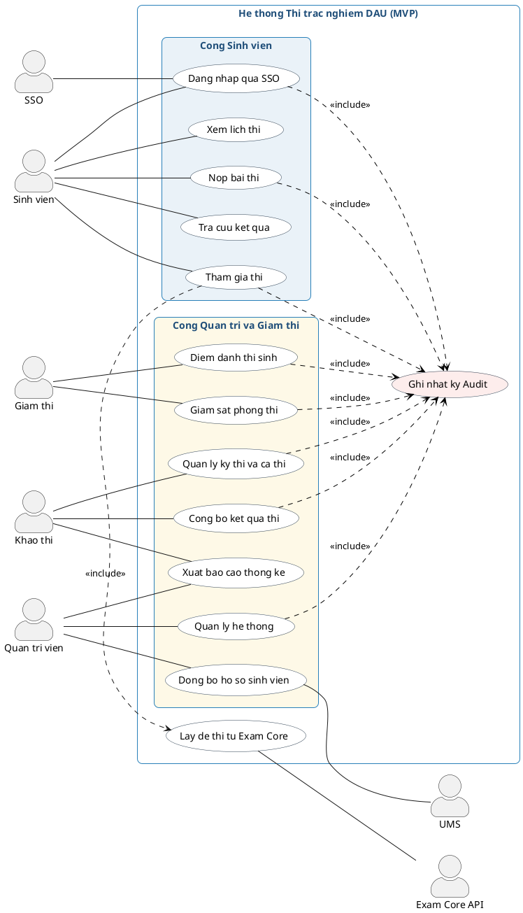
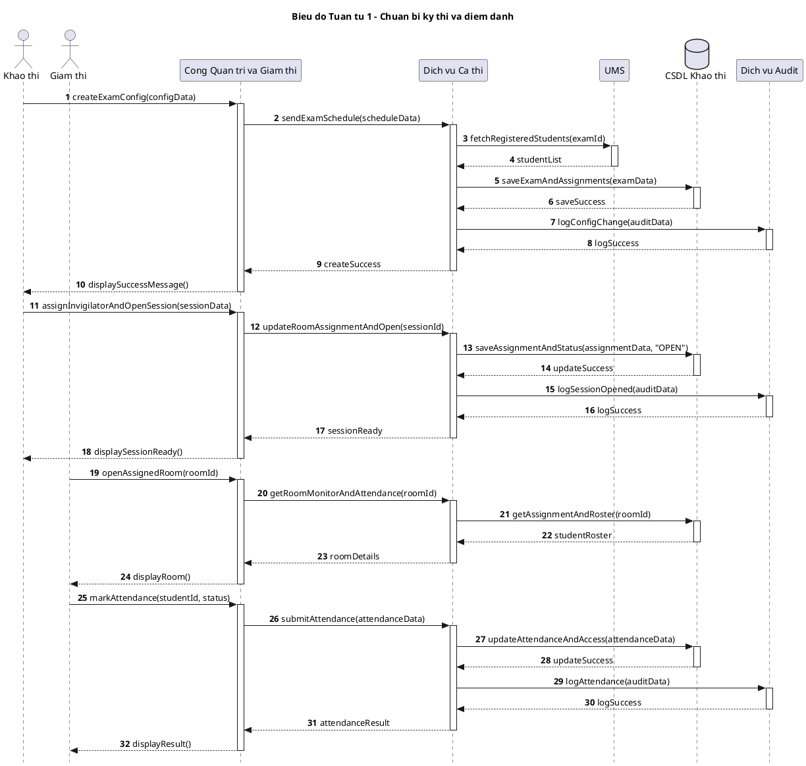
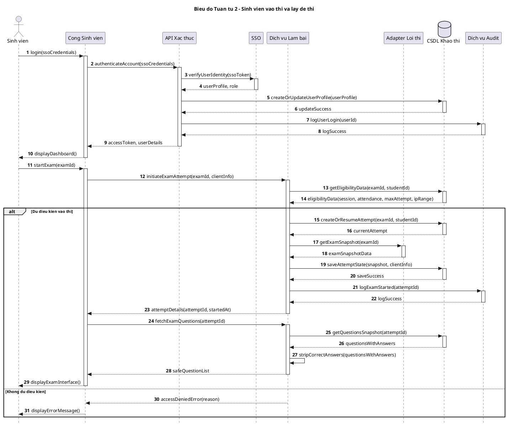
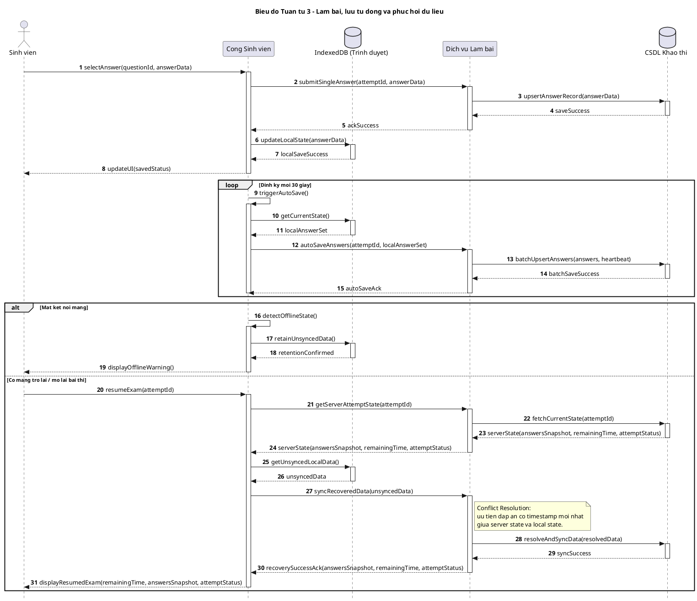
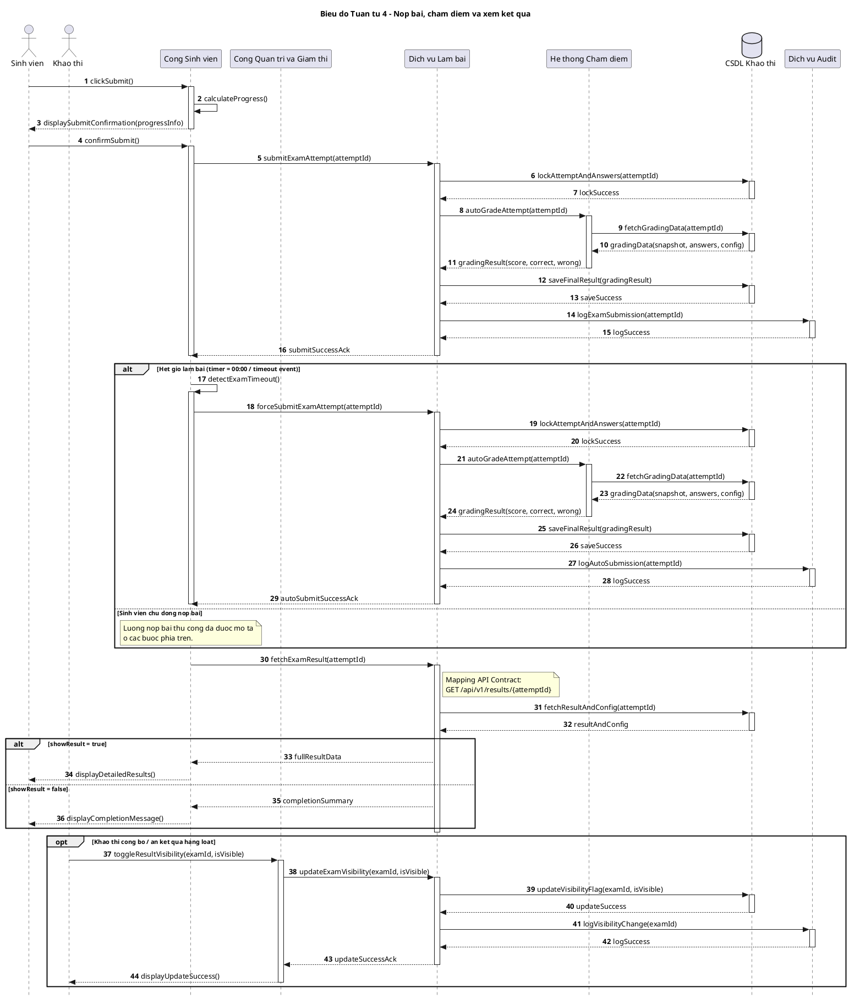
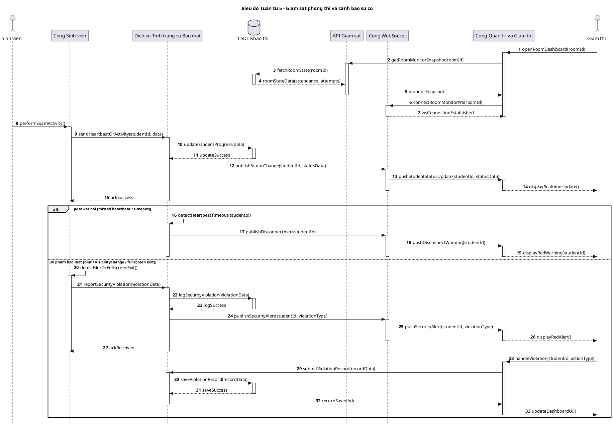

# 21. Use Case và Sequence — Nguồn UML + Ghi chú review/định hướng tương lai

> File này gộp 4 tài liệu cũ (`21-bao-cao-usecase-sequence.md`,
> `22-nhan-xet-usecase-sequence.md`, `23-ok-che-usecase-sequence-tuong-lai.md`,
> `24-bao-cao-usecase-sequence-tuong-lai.md`) thành một file duy nhất để tránh
> phân mảnh. Cấu trúc:
> - **Phần 1-8**: nguồn PlantUML use case/sequence gốc (current-state / core flow MVP).
> - **Phần 9**: ghi chú review + định hướng tương lai (rút gọn từ 3 file cũ).
>
> Để render lại **bộ ảnh chính** dùng cho báo cáo, ưu tiên dùng
> `docs/29-uml-source-pack.md` (đã hợp nhất, có nhãn current-state/target-state
> rõ ràng). File này giữ lại làm nguồn tham khảo current-state / core flow gốc.

Tài liệu tổng hợp mã sơ đồ PlantUML đồng bộ với:
- `docs/02-srs.md`
- `docs/03-use-cases.md`
- `docs/08-api-contract.md`
- `docs/17-exam-core-integration.md`
- `docs/18-auth-integration.md`

Lưu ý: các sequence bên dưới ưu tiên đúng nghiệp vụ và đúng API contract. Một số
luồng thể hiện mục tiêu nghiệp vụ tổng thể; các phần implementation chưa hoàn tất
được ghi chú ở Phần 9.

## 1. Use Case tổng quan hệ thống

> **Ghi chú (từ review):** use case `Lấy đề thi từ Exam Core` là luồng
> **hệ thống nội bộ** (system/integration use case), được `Tham gia thi` include —
> **không phải** thao tác nghiệp vụ do actor `Khảo thí` chủ động kích hoạt cho
> từng lượt thi (xem UC-060 trong `03-use-cases.md`). Sơ đồ trên đã đặt đúng vị
> trí; xem thêm mục 9.1.

## 2. Sequence - Chuan bi ky thi va diem danh

Phu hop voi:
- FR-C, FR-D, FR-E
- UC-025, UC-027, UC-036 -> UC-042

> **Ghi chú (từ review):** sequence này gộp khá nhiều việc (mở ca thi + điểm
> danh) nên hơi dài; chưa thể hiện rõ gán số báo danh/số máy thi, chưa có nhánh
> `Late`/`Violation`. Nếu triển khai chi tiết hơn, cân nhắc tách thành 2 sequence
> riêng (`Quản lý kỳ thi` và `Điểm danh phòng thi`) — xem mục 9.2.

## 3. Sequence - Sinh vien vao thi va lay de thi

Phu hop voi:
- FR-A, FR-B, FR-F, FR-P, FR-Q
- UC-001, UC-003, UC-006, UC-060

> **Ghi chú (từ review):** chưa mô tả ngoại lệ `Exam Core timeout / không lấy
> được đề` (xem UC-064); nếu mở rộng thêm, nên thêm nhánh `alt Không lấy được đề
> thi`. Xem mục 9.2.

## 4. Sequence - Lam bai, auto save va recovery

Phu hop voi:
- FR-G, FR-H
- UC-016, UC-017, UC-062, UC-063
- US-055 -> US-061

> **Ghi chú (từ review):** đây là sequence sát định hướng dài hạn nhất; nếu mở
> rộng thêm nên bổ sung `reviewFlags` (câu đánh dấu xem lại) và nhánh `alt
> autosave fail -> queue local retry`. Xem mục 9.2.

## 5. Sequence - Nop bai, cham diem va xem ket qua

Phu hop voi:
- FR-J, FR-K, FR-L, FR-O
- UC-018, UC-019, UC-020, UC-046, UC-047

> **Ghi chú (từ review):** endpoint xem kết quả trong sơ đồ dùng
> `GET /api/v1/results/{attemptId}`, khớp `08-api-contract.md`. Nếu code thực
> tế đã mở rộng sang endpoint khác (vd `/attempts/{id}/review`), cần cập nhật
> lại chú thích tại đây để tránh lệch giữa sequence và contract. Thiếu nhánh
> `submit fail / retry`, `grading fail` — xem mục 9.2.

## 6. Sequence - Giam sat phong thi va canh bao su co

Phu hop voi:
- FR-I, FR-M, FR-P
- UC-029 -> UC-035, UC-062, UC-066, UC-067

> **Ghi chú:** sequence này mô tả **mục tiêu nghiệp vụ mong muốn** nhiều hơn là
> trạng thái implementation đã ổn định — WebSocket/Invigilator Dashboard mới
> làm một phần (xem `16-traceability-matrix.md`). Nên gắn nhãn
> **target-state / Phase 2** khi trình bày trong báo cáo. Nhánh vi phạm bảo mật
> mô tả đúng bản chất "hệ thống tự phát hiện" (blur/tab-switch), không phải
> sinh viên tự khai báo.

## 7. Goi y chen vao bao cao Word

- Muc `4. Tac nhan su dung` + `5. Mo ta nghiep vu tong quan`: dung so do `Use Case tong quan he thong`.
- Muc `5.1 Truoc khi thi`: dung `Sequence 1 - Chuan bi ky thi va diem danh`.
- Muc `5.2 Vao thi`: dung `Sequence 2 - Sinh vien vao thi va lay de`.
- Muc `5.3 Lam bai`: dung `Sequence 3 - Lam bai, auto save va recovery`.
- Muc `5.4 Nop va cham diem` + `5.6 Sau thi`: dung `Sequence 4 - Nop bai, cham diem va xem ket qua`.
- Muc `5.5 Giam sat`: dung `Sequence 5 - Giam sat phong thi va canh bao su co` (gắn nhãn target-state).

## 8. Ghi chu pham vi va trang thai implementation

- Bo so do nay uu tien pham vi MVP va dong bo voi SRS / API Contract.
- Use case `Lay de thi tu Exam Core` la luong he thong noi bo duoc kich hoat trong qua trinh sinh vien vao thi, khong phai thao tac nghiep vu do actor Khao thi thuc hien truc tiep.
- Cac thanh phan realtime monitoring, browser lockdown nang cao, audit log day du, va load testing quy mo lon van la cac khu vuc can tiep tuc hoan thien theo trang thai implementation hien tai.

---

## 9. Ghi chú review & định hướng tương lai

> Phần này rút gọn nội dung của 3 file review cũ (`22-nhan-xet-usecase-sequence.md`,
> `23-ok-che-usecase-sequence-tuong-lai.md`, `24-bao-cao-usecase-sequence-tuong-lai.md`).
> Mục đích: giữ lại các nhận xét còn giá trị tham khảo khi cần chỉnh sửa sâu hơn
> bộ use case/sequence ở trên, mà không cần mở 3 file riêng.

### 9.1. Đánh giá tổng quan

Use case và sequence ở Phần 1-6 đã ở mức **dùng tốt cho MVP/core business flow**:
sơ đồ dễ đọc, tách rõ Cổng Sinh viên / Cổng Quản trị-Giám thị, có ý thức mô tả
service layer, audit, DB, và các nhánh `alt/opt/loop`. Sequence 2, 3, 4 khá vững
và nên giữ lại nguyên trạng. Sequence 5 đúng hướng nhưng nên luôn gắn nhãn
**target-state / Phase 2** khi đưa vào báo cáo (xem `16-traceability-matrix.md`
về mức độ hoàn thiện thực tế của monitoring/WebSocket).

Các ảnh trong `docs/images/` (sequenceDiagram, usecaseDiagram, classDiagram) đã
khớp với bộ UML text này — **không cần xóa**, tiếp tục dùng cho báo cáo.

### 9.2. Bảng OK / Chưa ổn / Hướng chỉnh trong tương lai

| Hạng mục | OK | Chưa đủ / cần chỉnh trong tương lai |
|---|---|---|
| Use case tổng quan | 4 actor đúng SRS, use case vào thi đã gán đúng chủ thể (`Lấy đề` là luồng hệ thống, không gán cho Khảo thí) | Thiếu vài use case "năng lực hệ thống": auto-save/recovery, chấm điểm tự động, bảo mật phòng thi, đồng bộ lịch thi, gửi kết quả về hệ thống nguồn — nên bổ sung nếu mở rộng use case tổng quan |
| Sequence 1 — Chuẩn bị kỳ thi & điểm danh | Luồng Khảo thí → mở ca → Giám thị → điểm danh rõ ràng | Gộp khá nhiều việc trong 1 sequence; chưa rõ gán số máy thi/số báo danh; thiếu nhánh `Late`/`Violation` khi điểm danh |
| Sequence 2 — Vào thi & lấy đề | Đã tách đúng bản chất "lấy đề" là luồng hệ thống; có check eligibility | Login + bắt đầu thi nằm chung 1 sequence hơi dài; thiếu ngoại lệ "Exam Core timeout/không lấy được đề" (UC-064) |
| Sequence 3 — Auto-save & recovery | Thể hiện đủ 3 lớp UI/IndexedDB/Server; đã có `remainingTime`, `attemptStatus`, `answersSnapshot` khi recovery | Chưa có `reviewFlags` (câu đánh dấu xem lại); chưa có nhánh `alt autosave fail -> queue local retry` |
| Sequence 4 — Nộp bài, chấm điểm, kết quả | Đã có cả nhánh auto-submit khi hết giờ; đã chuẩn hoá theo `results/{attemptId}` | Chưa thể hiện `showAnswers`/`showExplanation` khi xem kết quả; chưa có ngoại lệ `submit fail`/`grading fail`/`retry` |
| Sequence 5 — Giám sát & cảnh báo | Đúng bản chất: vi phạm do client tự phát hiện (không phải SV tự khai báo); có heartbeat, disconnect, security alert | Nên gắn nhãn rõ **target-state/Phase 2**; thiếu payload minh hoạ cụ thể cho event WebSocket; chưa có ngưỡng vi phạm dẫn đến auto-lock |

### 9.3. Đối chiếu với `docs/thietkehethong.txt` (đã gộp vào `docs/29-uml-source-pack.md`)

`docs/thietkehethong.txt` mô tả kiến trúc auto-save/nộp bài theo hướng
**Redis Cache + Write-Behind Worker + Message Queue** (kiến trúc *mục tiêu/tương
lai* cho quy mô lớn), khác với sequence ở Phần 4-5 vốn lưu thẳng DB (kiến trúc
*hiện trạng* đang triển khai thực tế — xem `17-exam-core-integration.md`,
`15-test-report-wave2-trac-nghiem.md`). Đây **không phải mâu thuẫn**, mà là hai
tầng tài liệu khác nhau:
- Phần 1-6 của file này = bản nghiệp vụ / current-state để đối chiếu SRS, dùng
  báo cáo nghiệp vụ.
- `docs/thietkehethong.txt` (nay đã gộp vào `docs/29-uml-source-pack.md`, mục
  "Target Architecture") = kiến trúc tương lai/full-scale, dùng khi thiết kế
  giai đoạn mở rộng tải lớn (2.000 phiên đồng thời).

### 9.4. Thiếu sót của hệ thống hiện tại (đối chiếu `00-brief.md`, `16-traceability-matrix.md`)

| Thành phần | Trạng thái | Đánh giá |
|---|---|---|
| Real-time Monitoring / WebSocket | Chưa thật sự đầy đủ | Cần đầu tư tiếp nếu muốn demo phòng thi thuyết phục |
| Browser Lockdown | Mới ở mức cơ bản (IP + một phần detect) | Chưa đủ "phòng thi an toàn" mức cao (SEB, auto-lock theo ngưỡng) |
| Audit Log | Có khung nhưng chưa phủ đầy đủ mọi sự kiện nhạy cảm | Nên mô tả là "đang có nền tảng", chưa hoàn tất 100% |
| Exam Core / UMS integration | Còn adapter/mock/feature flag | Hợp lý cho dev; khi viết báo cáo nên tách rõ current-state và target-state |
| Load test / Integration test | Chưa đầy đủ | Điểm yếu lớn nếu hệ thống hướng tới 2.000 concurrent users |

### 9.5. Nếu chỉnh tiếp trong tương lai — thứ tự ưu tiên

1. Bổ sung nhánh `alt Exam Core timeout / không lấy được đề` vào Sequence 2.
2. Bổ sung `reviewFlags` + nhánh `autosave fail -> retry` vào Sequence 3.
3. Bổ sung `alt showAnswers/hideAnswers`, `submit fail/retry` vào Sequence 4.
4. Bổ sung ngưỡng vi phạm → auto-lock + payload WebSocket minh hoạ vào Sequence 5,
   và luôn gắn nhãn target-state khi trình bày.
5. Nếu mở rộng use case tổng quan: thêm nhóm use case "năng lực hệ thống" (mục 9.1).
