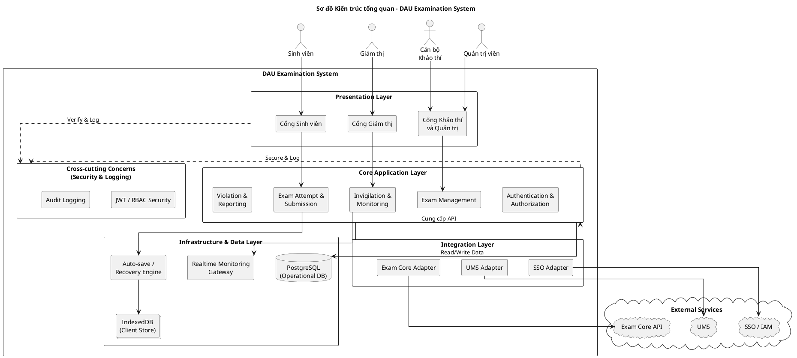
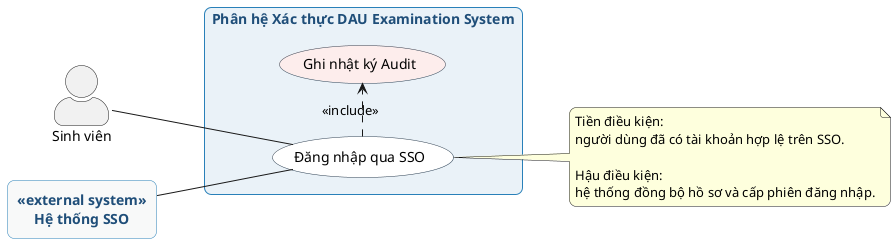
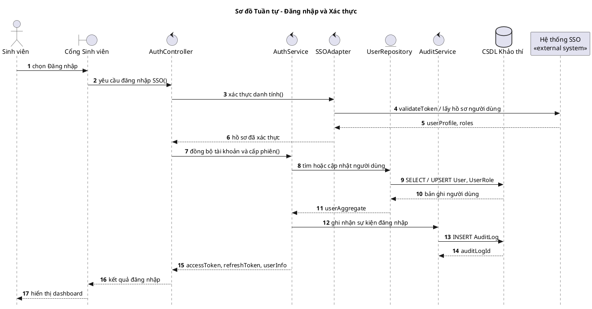
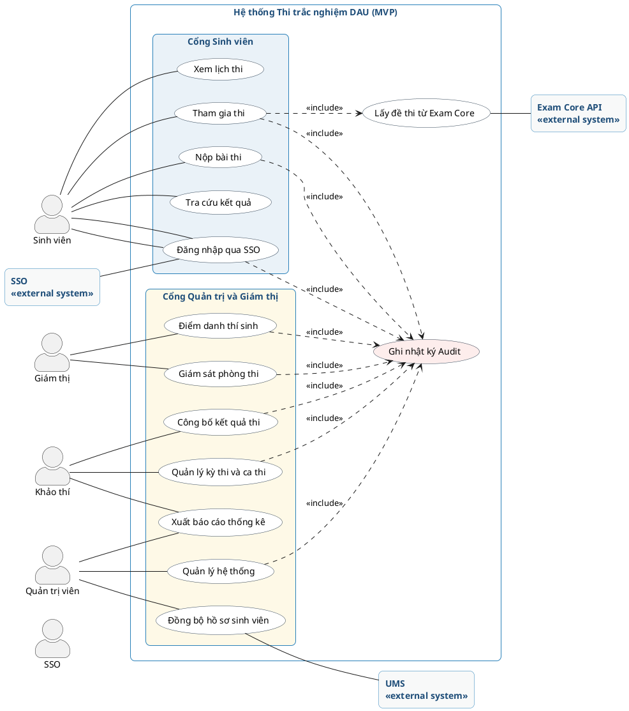
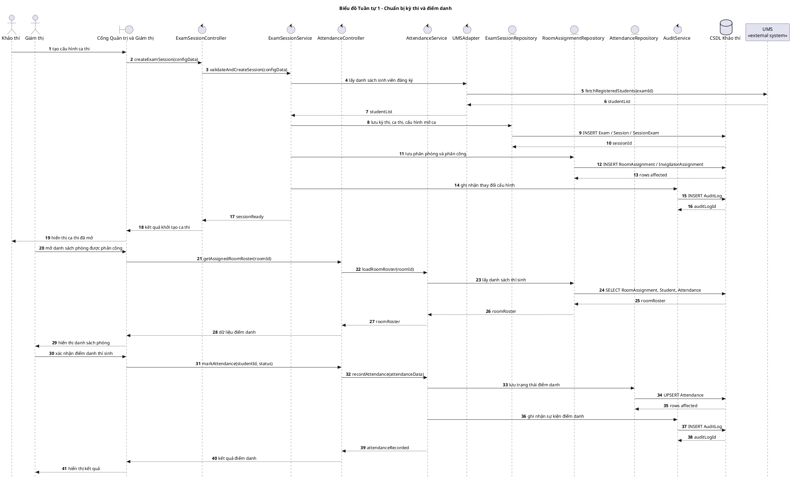
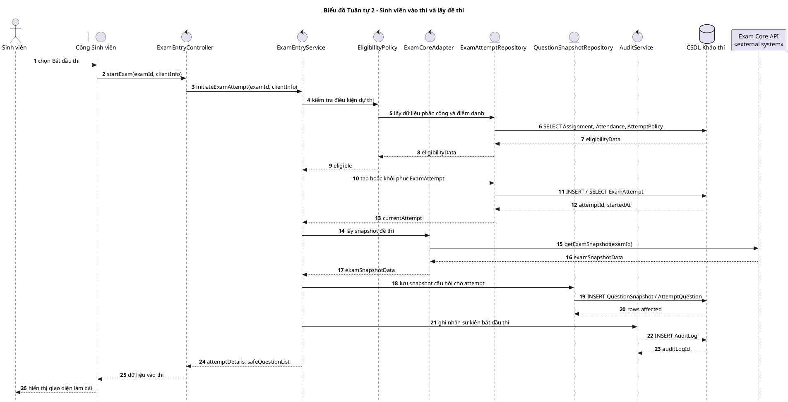
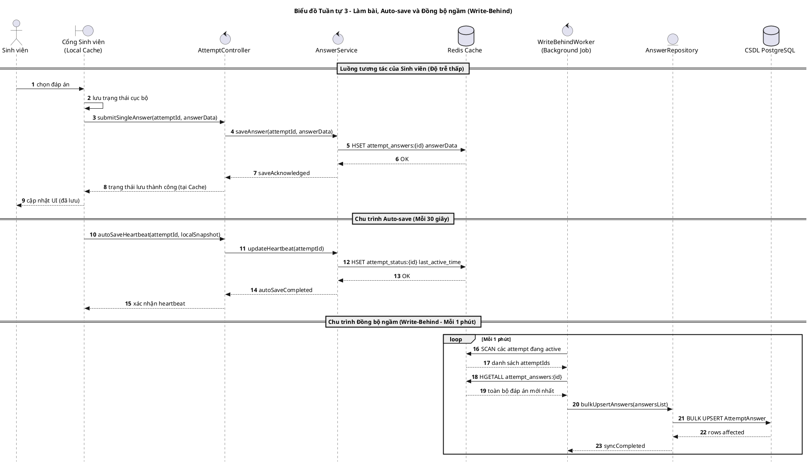
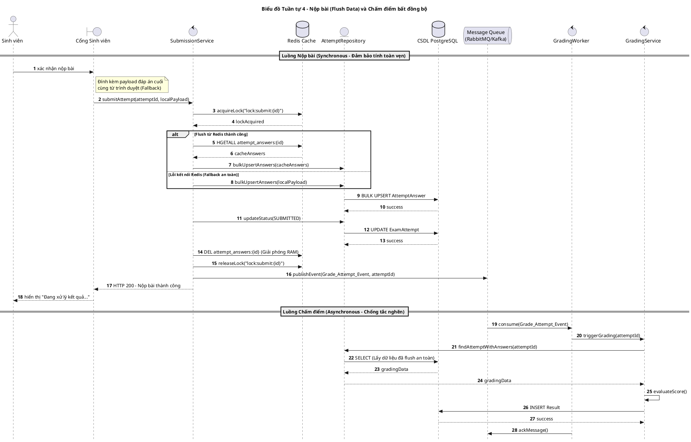
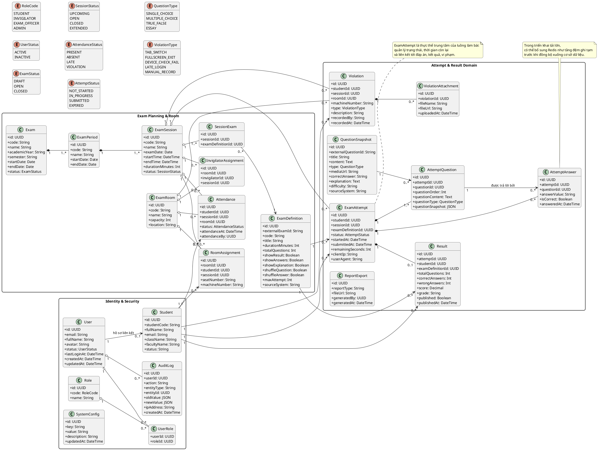

# 29. UML Source Pack cho báo cáo

Tài liệu này gom toàn bộ mã PlantUML cần dùng để tạo các ảnh chèn vào báo cáo.
Từ nay, nếu cần render lại ảnh, ưu tiên dùng file này thay vì `docs/21-usecase-sequence-uml.md`.

> File này cũng đã hấp thụ nội dung của `docs/thietkehethong.txt` (đã xóa) —
> xem ghi chú **kiến trúc hiện tại vs kiến trúc mục tiêu** ngay dưới đây.

## 1. Bộ ảnh chính nên dùng

| Thứ tự | Diagram ID | Tên ảnh đề xuất | Vai trò | Trạng thái |
|---|---|---|---|---|
| 1 | D01 | `docs/images/architectureDiagram/architecture-overview.png` | Kiến trúc tổng quan | current-state |
| 2 | D02 | `docs/images/usecaseDiagram/auth-usecase.png` | Use case đăng nhập và xác thực | current-state |
| 3 | D03 | `docs/images/sequenceDiagram/auth-login-sequence.png` | Sequence đăng nhập và xác thực | current-state |
| 4 | D04 | `docs/images/usecaseDiagram/exam-system-usecase-overview.png` | Use case tổng quan hệ thống | current-state |
| 5 | D05 | `docs/images/sequenceDiagram/exam-session-preparation-sequence.png` | Chuẩn bị kỳ thi và điểm danh | current-state |
| 6 | D06 | `docs/images/sequenceDiagram/exam-entry-fetch-sequence.png` | Sinh viên vào thi và lấy đề | current-state |
| 7 | D07 | `docs/images/sequenceDiagram/exam-autosave-recovery-sequence.png` | Làm bài, auto-save, recovery | **target-state** (kiến trúc Redis Cache + Write-Behind Worker cho tải lớn) |
| 8 | D08 | `docs/images/sequenceDiagram/exam-submit-grade-result-sequence.png` | Nộp bài, chấm điểm, xem kết quả | **target-state** (kiến trúc Message Queue + GradingWorker bất đồng bộ) |
| 9 | D09 | `docs/images/sequenceDiagram/invigilation-monitoring-sequence.png` | Giám sát phòng thi | **target-state / Phase 2** |
| 10 | D10 | `docs/images/classDiagram/domain-class-overview.png` | Class diagram tổng hợp | current-state |
| 11 | D11 | (ERD dbdiagram — đối chiếu `docs/07-erd.md`) | ERD chi tiết mức cột | current-state |

> ⚠️ **Quan trọng khi trình bày báo cáo/demo:** D07 và D08 mô tả kiến trúc
> **mục tiêu** (Redis, RabbitMQ/Kafka, worker bất đồng bộ) cho quy mô 2.000
> phiên đồng thời — đây **chưa phải** kiến trúc đang chạy thật. Theo
> `17-exam-core-integration.md`, `20-go-live-checklist.md` và
> `15-test-report-wave2-trac-nghiem.md`, hệ thống hiện tại lưu đáp án **thẳng
> vào PostgreSQL qua Prisma** (không Redis/message queue), và auto-submit dùng
> `@nestjs/schedule` cron mỗi phút — không phải cơ chế Write-Behind/Kafka như
> D07/D08 mô tả. Khi đưa D07/D08 vào báo cáo, **luôn ghi chú rõ "kiến trúc mục
> tiêu / định hướng mở rộng"**, tránh để người đọc hiểu nhầm đây là hiện trạng.

## 2. Nguyên tắc sử dụng

- `D01 -> D06`, `D10`, `D11` phản ánh đúng hiện trạng, dùng thẳng cho báo cáo nghiệp vụ.
- `D07`, `D08`, `D09` là kiến trúc/luồng **mục tiêu (target-state)** — luôn gắn nhãn rõ khi trình bày, không mô tả như đã hoàn thiện.
- `D10` là class diagram tổng hợp để chèn vào phần thiết kế dữ liệu và domain.
- Nếu cần ERD riêng mức cột, đối chiếu `docs/07-erd.md` hoặc `D11` bên dưới.

## 3. Nguồn PlantUML

### D01. Kiến trúc tổng quan



### D02. Use Case - Đăng nhập và Xác thực



### D03. Sequence - Đăng nhập và Xác thực



### D04. Use Case tổng quan hệ thống



### D05. Sequence - Chuẩn bị kỳ thi và điểm danh



### D06. Sequence - Sinh viên vào thi và lấy đề



### D07. Sequence - Làm bài, auto-save và recovery



### D09. Sequence - Giám sát phòng thi và cảnh báo sự cố



### D10. Class Diagram tổng hợp


### D11 ERD
```plantuml
// ==========================================
// 1. IDENTITY & SECURITY DOMAIN
// ==========================================
Table User {
  id uuid [primary key]
  username varchar
  fullname varchar
  email varchar
  avatar varchar
  status varchar
  isDeleted boolean
  deletedAt timestamp
  lastLoginAt timestamp
  createdAt timestamp
  updatedAt timestamp
}

Table Role {
  id uuid [primary key]
  code varchar
  name varchar
}

Table UserRole {
  userId uuid
  roleId uuid
}

Table StudentProfile {
  id uuid [primary key]
  userId uuid 
  studentCode varchar
  fullName varchar
  className varchar
}

// ==========================================
// 2. EXAM PLANNING DOMAIN
// ==========================================
Table Exam {
  id uuid [primary key]
  code varchar
  name varchar
  academicYear varchar
  semester varchar
  startDate timestamp
  endDate timestamp
  status varchar
  createdAt timestamp
  updatedAt timestamp
}

Table ExamDefinition {
  id uuid [primary key]
  examId uuid
  code varchar
  title varchar
  durationMinutes integer
  totalQuestions integer
  sourceSystem varchar
  showResult boolean
  showAnswers boolean
  showExplanation boolean
  createdAt timestamp
}

Table ExamPeriod {
  id uuid [primary key]
  examId uuid
  code varchar
  name varchar
  startDate timestamp
  endDate timestamp
  createdAt timestamp
}

Table ExamSession {
  id uuid [primary key]
  periodId uuid
  code varchar
  name varchar
  examDate date
  startTime timestamp
  endTime timestamp
  durationMinutes integer
  status varchar
  createdBy uuid
  updatedBy uuid
  createdAt timestamp
  updatedAt timestamp
}

Table SessionRoom {
  id uuid [primary key]
  sessionId uuid
  roomId uuid
  examDefinitionId uuid
}

// ==========================================
// 3. ROOM & ASSIGNMENT DOMAIN
// ==========================================
Table ExamRoom {
  id uuid [primary key]
  code varchar
  name varchar
  capacity integer
  location varchar
  createdAt timestamp
  updatedAt timestamp
}

Table RoomAssignment {
  id uuid [primary key]
  roomId uuid
  sessionId uuid
  studentId uuid
  seatNumber varchar
  machineNumber varchar
  createdAt timestamp
}

Table InvigilatorAssignment {
  id uuid [primary key]
  roomId uuid
  invigilatorId uuid
  sessionId uuid
  createdAt timestamp
}

// ==========================================
// 4. ATTEMPT & MONITORING DOMAIN
// ==========================================
Table Attendance {
  id uuid [primary key]
  studentId uuid
  sessionId uuid
  roomId uuid
  status varchar
  attendanceTime timestamp
  createdAt timestamp
}

Table ExamAttempt {
  id uuid [primary key]
  studentId uuid
  sessionId uuid
  examDefinitionId uuid
  status varchar
  startTime timestamp
  submitTime timestamp
  remainingSeconds integer
  score float
  clientIp varchar
  userAgent varchar
  createdAt timestamp
}

Table QuestionSnapshot {
  id uuid [primary key]
  externalQuestionId varchar
  title varchar
  content text
  type varchar
  mediaUrl varchar
  correctAnswer text
  explanation text
  difficulty varchar
  sourceSystem varchar
  createdAt timestamp
}

Table AttemptQuestion {
  id uuid [primary key]
  attemptId uuid
  questionId uuid
  questionOrder integer
  questionContent text
  questionType varchar
  questionSnapshot text
  createdAt timestamp
}

Table AttemptAnswer {
  id uuid [primary key]
  attemptId uuid
  questionId uuid
  answerValue text
  isCorrect boolean
  answeredAt timestamp
}

// ==========================================
// 5. RESULTS & VIOLATION DOMAIN
// ==========================================
Table Result {
  id uuid [primary key]
  attemptId uuid
  studentId uuid
  examDefinitionId uuid
  totalQuestions integer
  correctAnswers integer
  wrongAnswers integer
  score float
  grade varchar
  published boolean
  publishedAt timestamp
  createdAt timestamp
  updatedAt timestamp
}

Table Violation {
  id uuid [primary key]
  studentId uuid
  sessionId uuid
  roomId uuid
  machineNumber varchar
  type varchar
  description text
  recordedBy uuid
  recordedAt timestamp
  createdAt timestamp
  updatedAt timestamp
}

Table ViolationAttachment {
  id uuid [primary key]
  violationId uuid
  fileName varchar
  fileUrl varchar
  uploadedAt timestamp
}

// ==========================================
// 6. SYSTEM & AUDIT DOMAIN
// ==========================================
Table ReportExport {
  id uuid [primary key]
  reportType varchar
  fileUrl varchar
  generatedBy uuid
  createdAt timestamp
}

Table Auditing {
  id uuid [primary key]
  userId uuid
  action varchar
  entityType varchar
  entityId uuid
  oldValue text
  newValue text
  ipAddress varchar
  createdAt timestamp
}

Table SystemConfig {
  id uuid [primary key]
  key varchar
  value text
  description varchar
  updatedBy uuid 
  updatedAt timestamp
}

// ==========================================
// RELATIONSHIPS (FOREIGN KEYS)
// ==========================================

// Identity & System Auditing
Ref: UserRole.userId > User.id
Ref: UserRole.roleId > Role.id
Ref: StudentProfile.userId > User.id
Ref: SystemConfig.updatedBy > User.id
Ref: Auditing.userId > User.id
Ref: ReportExport.generatedBy > User.id

// Exam Definition & Session
Ref: ExamPeriod.examId > Exam.id
Ref: ExamDefinition.examId > Exam.id
Ref: ExamSession.periodId > ExamPeriod.id
Ref: ExamSession.createdBy > User.id
Ref: ExamSession.updatedBy > User.id

// Room & Assignments
Ref: SessionRoom.sessionId > ExamSession.id
Ref: SessionRoom.roomId > ExamRoom.id
Ref: SessionRoom.examDefinitionId > ExamDefinition.id
Ref: RoomAssignment.roomId > ExamRoom.id
Ref: RoomAssignment.sessionId > ExamSession.id
Ref: RoomAssignment.studentId > StudentProfile.id
Ref: InvigilatorAssignment.roomId > ExamRoom.id
Ref: InvigilatorAssignment.sessionId > ExamSession.id
Ref: InvigilatorAssignment.invigilatorId > User.id

// Attempt & Monitoring
Ref: Attendance.studentId > StudentProfile.id
Ref: Attendance.sessionId > ExamSession.id
Ref: Attendance.roomId > ExamRoom.id

Ref: ExamAttempt.studentId > StudentProfile.id
Ref: ExamAttempt.sessionId > ExamSession.id
Ref: ExamAttempt.examDefinitionId > ExamDefinition.id

Ref: AttemptQuestion.attemptId > ExamAttempt.id
Ref: AttemptQuestion.questionId > QuestionSnapshot.id
Ref: AttemptAnswer.attemptId > ExamAttempt.id
Ref: AttemptAnswer.questionId > AttemptQuestion.id

// Result & Violation
Ref: Result.attemptId > ExamAttempt.id
Ref: Result.studentId > StudentProfile.id
Ref: Result.examDefinitionId > ExamDefinition.id

Ref: Violation.studentId > StudentProfile.id
Ref: Violation.sessionId > ExamSession.id
Ref: Violation.roomId > ExamRoom.id
Ref: Violation.recordedBy > User.id
Ref: ViolationAttachment.violationId > Violation.id
```